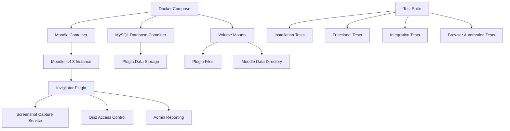
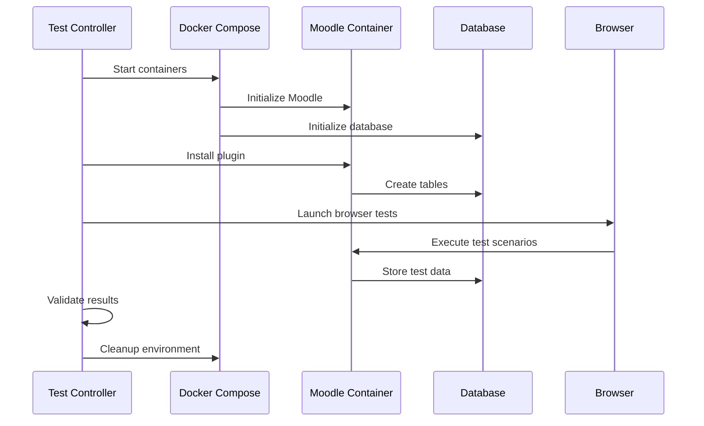

# Design Document: Moodle Invigilator Plugin Testing Environment

## Overview

This design outlines a comprehensive Docker-based testing environment for the Moodle Invigilator plugin with Moodle 4.4.3. The solution provides an isolated, reproducible environment for testing all plugin functionality including screenshot capture, quiz access control, and administrative reporting features.

## Architecture

### System Components



### Container Architecture

- **Moodle Container**: Official Moodle 4.4.3 image with PHP 8.1+ and Apache
- **Database Container**: MySQL 8.0 for data persistence
- **Volume Strategy**: Bind mounts for plugin development and named volumes for data persistence
- **Network Configuration**: Custom Docker network for container communication

## Components and Interfaces

### Docker Environment Setup

**Docker Compose Configuration**
- Service definitions for Moodle and MySQL containers
- Environment variable configuration for Moodle settings
- Volume mappings for plugin files and data persistence
- Port mapping for web access (default: 8080)
- Health checks for service availability

**Moodle Container Customization**
- Base image: `moodle:4.4.3-apache`
- Custom Dockerfile for additional dependencies if needed
- Plugin installation via volume mount or COPY instruction
- Configuration for screenshot capture permissions

### Plugin Installation System

**Installation Methods**
1. **Volume Mount Method**: Mount plugin directory directly into container
2. **Build-time Installation**: Copy plugin during image build
3. **Runtime Installation**: Install plugin through Moodle admin interface

**Installation Validation**
- Plugin detection in Moodle admin interface
- Database table creation verification
- Permission and capability checks
- Version compatibility validation

### Testing Framework

**Test Categories**

1. **Installation Tests**
   - Plugin file structure validation
   - Database schema creation
   - Moodle integration verification
   - Version compatibility checks

2. **Functional Tests**
   - Quiz access control behavior
   - Screenshot capture mechanism
   - Permission request handling
   - Image storage and retrieval

3. **Integration Tests**
   - Moodle 4.4.3 API compatibility
   - User interface integration
   - Database operations
   - File system operations

4. **Browser Automation Tests**
   - End-to-end quiz workflow
   - Screenshot permission handling
   - Admin interface navigation
   - Cross-browser compatibility

### Screenshot Capture System

**Technical Implementation**
- Browser Screen Capture API integration
- WebRTC getDisplayMedia() for screen sharing
- Canvas-based image processing
- AJAX-based image upload to Moodle

**Storage Architecture**
- PNG image format for screenshots
- Moodle file API for storage management
- Database records for metadata tracking
- Configurable retention policies

## Data Models

### Database Schema Extensions

**Screenshot Records Table**
```sql
CREATE TABLE mdl_quizaccess_invigilator_logs (
    id BIGINT PRIMARY KEY AUTO_INCREMENT,
    courseid BIGINT NOT NULL,
    quizid BIGINT NOT NULL,
    userid BIGINT NOT NULL,
    attemptid BIGINT NOT NULL,
    screenshot_path VARCHAR(255),
    timestamp BIGINT NOT NULL,
    file_size INT,
    created_at TIMESTAMP DEFAULT CURRENT_TIMESTAMP
);
```

**Configuration Table**
```sql
CREATE TABLE mdl_quizaccess_invigilator_settings (
    id BIGINT PRIMARY KEY AUTO_INCREMENT,
    quizid BIGINT NOT NULL,
    capture_interval INT DEFAULT 30,
    enabled TINYINT DEFAULT 1,
    require_permission TINYINT DEFAULT 1
);
```

### File System Structure

**Plugin Directory Layout**
```
/var/www/html/mod/quiz/accessrule/invigilator/
├── classes/
├── db/
├── lang/
├── amd/
├── pix/
├── version.php
├── rule.php
└── lib.php
```

**Data Storage Structure**
```
/var/www/moodledata/
├── filedir/
│   └── screenshots/
│       └── [hashed_paths]/
└── temp/
    └── invigilator/
```

## Error Handling

### Plugin Installation Errors
- **Missing Dependencies**: Validate PHP extensions and Moodle version
- **Permission Issues**: Check file system permissions and ownership
- **Database Errors**: Handle schema creation failures gracefully
- **Version Conflicts**: Provide clear compatibility error messages

### Runtime Error Handling
- **Screenshot Capture Failures**: Fallback mechanisms and user notifications
- **Permission Denied**: Clear messaging and alternative access paths
- **Storage Failures**: Disk space monitoring and cleanup procedures
- **Network Issues**: Retry mechanisms for image uploads

### Testing Error Recovery
- **Container Startup Failures**: Health checks and restart policies
- **Test Environment Cleanup**: Automated reset procedures
- **Data Corruption**: Backup and restore mechanisms
- **Browser Automation Failures**: Retry logic and alternative selectors

## Testing Strategy

### Test Environment Management

**Environment Lifecycle**
1. **Setup Phase**: Container orchestration and plugin installation
2. **Test Execution**: Automated test suite execution
3. **Validation Phase**: Result verification and reporting
4. **Cleanup Phase**: Environment reset and resource cleanup

**Test Data Management**
- Sample course and quiz creation
- Test user account provisioning
- Screenshot sample generation
- Database state management

### Automated Testing Pipeline

**Test Execution Flow**


**Test Categories and Tools**
- **Unit Tests**: PHPUnit for PHP code testing
- **Integration Tests**: Moodle PHPUnit framework
- **Browser Tests**: Selenium WebDriver or Playwright
- **API Tests**: REST API endpoint validation
- **Performance Tests**: Load testing for screenshot capture

### Manual Testing Procedures

**Admin Interface Testing**
1. Plugin configuration validation
2. Report generation and filtering
3. Screenshot viewing and management
4. User permission management

**Student Experience Testing**
1. Quiz access with plugin enabled
2. Permission request handling
3. Screenshot capture during quiz
4. Error scenario handling

**Cross-browser Compatibility**
- Chrome/Chromium screenshot API support
- Firefox compatibility testing
- Safari limitations and workarounds
- Mobile browser considerations

## Security Considerations

### Privacy and Data Protection
- Screenshot data encryption at rest
- Secure transmission of captured images
- User consent management
- Data retention and deletion policies

### Access Control
- Role-based permission system
- Screenshot viewing restrictions
- Admin interface security
- API endpoint protection

### Browser Security
- Screen capture permission handling
- Cross-origin request management
- Content Security Policy compliance
- XSS prevention measures

## Performance Optimization

### Screenshot Capture Optimization
- Image compression settings
- Capture frequency configuration
- Bandwidth usage monitoring
- Storage space management

### Database Performance
- Index optimization for queries
- Data archiving strategies
- Connection pooling
- Query performance monitoring

### Container Resource Management
- Memory allocation for image processing
- CPU usage optimization
- Disk I/O performance
- Network bandwidth management